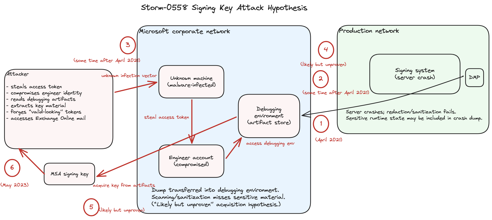

# The Day Microsoft Lost Its Signing Key
## How one movable signing key collapsed the cloud’s circle of trust

In my previous post, I argued that a private key must be born, live, and die on the system that uses it. I call this Key Locality. The rule is simple: signing material must not become portable, even indirectly through operational workflows.

In cloud identity, signing keys are delegated trust at internet scale. Once a key escapes its boundary, the blast radius is determined by how strictly relying parties enforce token semantics.

The 2023 Storm-0558 incident demonstrated what happens when both principles fail. First, a key custody failure violated Key Locality, allowing a signing key to escape its secure boundary. Second, a validation failure allowed that escaped key to be used outside its intended context, forging consumer tokens that were incorrectly accepted for Enterprise Exchange Online access. [1]

---

## TL;DR

- Key Locality is an engineering property. If key material can land in portable artifacts, custody already failed. [2]  
- The most likely acquisition story involves a compromised engineer identity and access to internal debugging/incident artifact paths (crash dumps are one hypothesis, not the only class of risk). [2]  
- After key compromise, outcome depended on validation discipline. At least one relying path did not strictly enforce issuer/audience semantics. [3]  
- Treat zone crossings as real security boundaries. Fail-closed sanitization, constrained read access, and artifact-aware monitoring are baseline controls when artifacts can contain runtime state. [2]  

---

## 1. The Core Concept: Key Locality

Key Locality is often misinterpreted as “use HSM-backed keys.” HSMs help, but the requirement is stronger: eliminate paths that allow key material to leave its boundary, including paths created by reliability, operability, and debugging.

If private key material can show up in runtime state where it can be copied or serialized, it can leak through many mechanisms, including:

- failure artifacts (crash dumps, process snapshots)  
- diagnostics (debug bundles, support packages)  
- telemetry mistakes (logs, event payloads)  
- dev/build plumbing (artifact stores, build caches, test outputs)  
- human workflows (ticket attachments, incident packages, internal shares)  
- retention systems (backups, long-lived repositories)  

You can call these engineering artifacts, but to an attacker, they are data exfiltration paths.

---

## 2. What Key, What Scope, What Broke

The incident involved a Microsoft Account (MSA) consumer signing key, described publicly as dating back to the 2016 era. Its intended scope was consumer identity flows like Outlook.com, not enterprise authorization flows like Exchange Online. [2]

Microsoft reported a validation issue where at least one relying party did not strictly enforce issuer and audience checks. The token’s signature was validated, but the semantics for the target workload were not enforced consistently. [3]

The CSRB frames this as a structural risk in environments with multiple identity systems (such as MSA and Microsoft Entra ID). Separation depends on relying parties consistently enforcing issuer and audience rules. Signature verification confirms integrity, but it does not by itself prove the token is intended for a given workload. If issuer/audience enforcement is inconsistent, tokens can be accepted outside their intended domain. [4]

Engineers should internalize the failure mode: a token can be mathematically valid while still logically invalid for a given service context. [3]

### Minimum validation bar

- Issuer: exact issuer expected for the flow, not “any Microsoft issuer.”  
- Audience: exact audience for the service, not a different workload.  
- Token class / version: reject unsupported token types and versions.  
- Trust-set binding: keys valid for one token class must not validate another.  
- Tenant/workload constraints: enterprise authorization must enforce enterprise semantics.  

---

## 3. How the Key Escaped

### Storm-0558 Signing Key Attack Hypothesis

Microsoft’s published investigation describes a most likely acquisition path along these lines: [2]

- A Microsoft engineer’s corporate account was compromised using an access token obtained from a malware-infected machine. [2]  
- That identity had access to internal debugging systems. [2]  
- A crash in a consumer signing system produced a process snapshot or crash dump. Microsoft’s working theory is that sensitive material could have been present in that artifact and the expected controls did not prevent sensitive material from leaving the isolated environment. [2]  
- The actor accessed the debugging environment and exfiltrated material consistent with key acquisition. [2]  
- Microsoft also stated it did not find a crash dump that conclusively contained the exact impacted key material, even though the crash dump/debug path remained central to the “most likely” acquisition story. [2]  

From a Key Locality perspective, the precise file is not the core issue. If key material can appear in portable engineering artifacts that cross zones, Key Locality has already failed. The system design has allowed keys to behave like data.

---

## 4. Security Zone Failure

Mature engineering organizations run multiple security zones: isolated production and signing systems, corporate engineering networks, debugging/support platforms, and developer/admin endpoints. The risk is not that zones exist. The risk is uncontrolled movement between them, where artifacts or access paths cross boundaries without deterministic safeguards.

If high-trust artifacts can be exported into lower-trust systems, an attacker does not need a foothold in the high-trust zone. They compromise an identity in a lower-trust zone and use artifact handling as the exfil path. [2]

Trust zones fail in two directions:

**High to Low (leakage / exfiltration):** sensitive material from a high-trust environment becomes accessible in lower-trust systems with broader access and longer retention. Payload is not limited to dumps. It can be diagnostics, logs, tokens, certificates, signing material, sensitive data, incident artifacts.

**Low to High (injection / contamination):** lower-trust inputs or tooling influence higher-trust systems and workflows. This includes debug/support paths where compromised identities or automation can trigger high-impact actions inside privileged environments.

---

## 5. Why Keys Stay Alive

Keys persist longer than intended because they accumulate dependencies. Rotation causes outages; outages create fear; fear turns into delay. The CSRB notes the key should have been retired earlier, but retirement was deferred after prior consumer key rotations caused outages. [4]. Artifact sprawl extends exposure. If key material can appear in dumps, bundles, logs, ticket attachments, artifact stores, backups, or internal shares, it can remain accessible long after the signing boundary assumes it is gone.

---

## 6. Why This Was Quiet

Microsoft stated the actor obtained a corporate access token from a malware-infected device and used it to compromise an engineer identity with access to internal debugging systems. [2] When an actor uses valid credentials or stolen session tokens, activity follows normal authentication flows. Classic signals like repeated login failures may not show up. Higher-signal telemetry often appears at the access layer: unusual reads, bulk downloads, and abnormal access to debugging artifacts and incident data stores. CISA’s monitoring guidance is a good starting point for what to look for in M365 telemetry. [5]

---

## 7. Defender Takeaway

### Customer-side: detection and response

- Create custom detections for your highest-value users and assets, aligned to your business context and normal access patterns.  
- Assume stolen session tokens reduce the value of sign-in anomaly detection. Prioritize behavioral and access-pattern anomalies (reads, downloads, mailbox access patterns). [5]  

### Provider-side: engineering controls

- Design for failure modes: ensure key material cannot end up in portable artifacts via dumps, traces, support bundles, logs, or incident packages. [2]  
- Standardize validation: do not implement token validation as service-local logic; enforce issuer and audience policy consistently. [3]  
- Partition signing trust to reduce blast radius: keys should not be usable across unrelated identity flows. [4]  
- Treat artifact movement as a boundary: crash dumps were intended to be redacted before leaving an isolated environment, implying an export gate. If the gate is imperfect, debugging artifacts become a data-loss path. [2]  

### Baseline controls for artifact export

- Controlled export pipeline only: artifacts leave through approved mechanisms with clear provenance and purpose.  
- Deterministic sanitization that fails closed: if safety cannot be established, export is blocked.  
- Secret scanning as a backstop: scan exports for key-shaped material and secret patterns, assuming blind spots. [2]  
- Quarantine and approval: flagged exports do not progress without explicit review and release.  
- Egress controls: enforce allowed destinations and retention; prevent movement into unmanaged shares, ticket attachments, and ad-hoc storage.  
- Repository controls focused on reads: least privilege, just-in-time access, rate limits, and strong auditing because reads are the primary exfil path.  
- Boundary-aware telemetry: alert on bulk reads, unusual export volume, anomalous callers, and atypical access to debugging and artifact systems.  

### Workstation hygiene for privileged workflows

Use hardened admin workstations for identities that can access engineering systems and control planes (CI/CD, source control administration, cloud management, and secrets/identity configuration), so a malware-infected device is less likely to become the entry point for high-impact compromise. [6]

These are not extra hardening requirements. They are baseline controls for mature engineering orgs operating large-scale, high-impact, internet-facing services.

---

## 8. Microsoft’s SFI Direction

Microsoft’s Secure Future Initiative describes architecture and process changes that map directly to these failure modes, including identity/secret hardening and stronger standards for how identities, tokens, and secrets are issued, stored, and used. [7]

- Key segmentation: Microsoft is moving toward finer-grained partitioning so identity signing keys don’t behave like global skeleton keys. A key compromised in one slice should not validate tokens in other slices. [7]  
- Confidential computing for signing: Move token signing into hardware-isolated, memory-encrypted environments (confidential VMs) to reduce the chance that operational artifacts expose sensitive runtime state. [7]  
- Key isolation: Strengthen hardware-backed isolation and defense-in-depth controls around signing keys to reduce portability through debugging and operations. [7]  
- Validation standardization: Push token acquisition/validation toward standardized, vetted implementations to reduce inconsistent issuer/audience enforcement across workloads. [7]  
- Privileged identity hardening: Expand phishing-resistant MFA and stricter controls for identities that can access engineering systems, debugging platforms, and control planes. [7]  
- Safe secrets posture: Reduce long-lived app secrets by shifting to system-managed credentials and tighter secret-handling standards. [7]  
- Shorter exposure + better telemetry: Shorten credential/key validity where possible and improve auditing/telemetry to detect forged-token use and abnormal access to sensitive artifacts. [8]  

---

## 9. The Lesson: Keys Are Sticky

Storm-0558 is a clean proof that Key Locality is an engineering property. If private key material can appear in engineering artifacts, it stops behaving like a key protected by a boundary and starts behaving like portable data. Once that happens, the compromise window is no longer bounded by the key’s intended lifecycle. It becomes bounded by artifact retention, repository read paths, and how reliably zone crossings are controlled.

In identity systems, token signatures establish integrity. Safety still depends on enforcing semantics. When key custody and validation discipline both degrade, “valid-looking” tokens become a practical impersonation mechanism at cloud scale.

---

## References

[1] Microsoft MSRC (Jul 11, 2023) “Microsoft mitigates China-based threat actor Storm-0558 targeting of customer email”  
https://www.microsoft.com/en-us/msrc/blog/2023/07/microsoft-mitigates-china-based-threat-actor-storm-0558-targeting-of-customer-email

[2] Microsoft MSRC (Sep 6, 2023) “Results of Major Technical Investigations for Storm-0558 Key Acquisition”  
https://www.microsoft.com/en-us/msrc/blog/2023/09/results-of-major-technical-investigations-for-storm-0558-key-acquisition

[3] Microsoft Security Blog (Jul 14, 2023) “Analysis of Storm-0558 techniques for unauthorized email access”  
https://www.microsoft.com/en-us/security/blog/2023/07/14/analysis-of-storm-0558-techniques-for-unauthorized-email-access/

[4] Cyber Safety Review Board (Mar 20, 2024) “Review of the Summer 2023 Microsoft Exchange Online Intrusion” (PDF)  
https://www.cisa.gov/sites/default/files/2025-03/CSRBReviewOfTheSummer2023MEOIntrusion508.pdf

[5] CISA Cybersecurity Advisory (AA23–193A) (Jul 12, 2023) “Enhanced Monitoring to Detect APT Activity Targeting Outlook Online”  
https://www.cisa.gov/news-events/cybersecurity-advisories/aa23-193a

[6] Microsoft Learn (Jan 29, 2024) “Why are privileged access devices important”  
https://learn.microsoft.com/en-us/security/privileged-access-workstations/privileged-access-devices

[7] Microsoft Learn (Jan 19, 2026) “Protect identities and secrets in the Microsoft Secure Future Initiative (SFI)”  
https://learn.microsoft.com/en-us/security/zero-trust/sfi/secure-future-initiative-identity-overview
